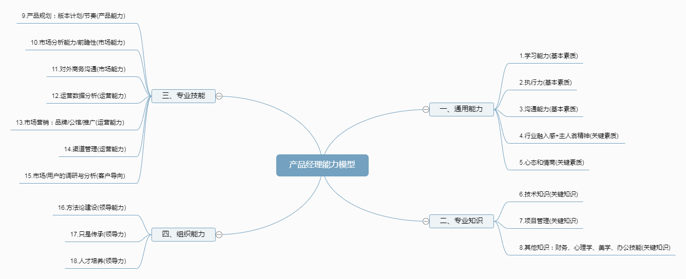
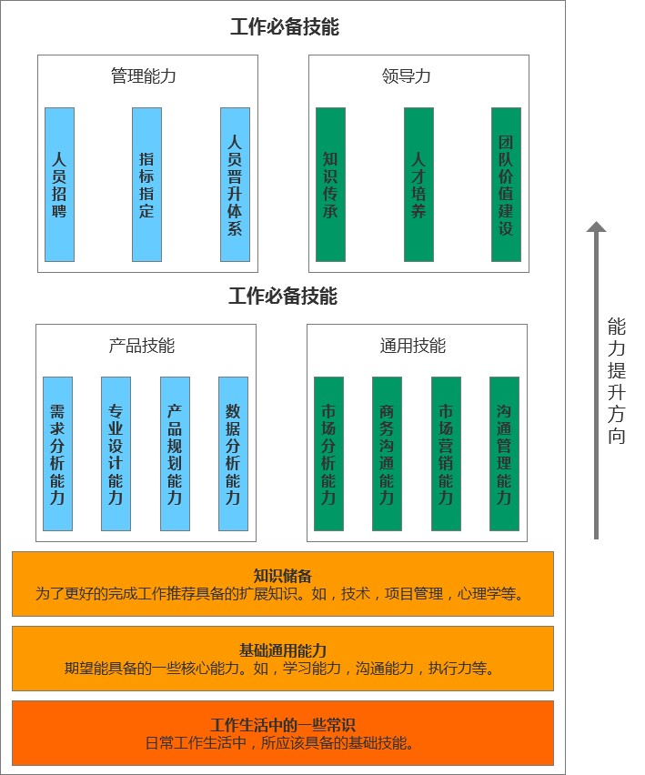

## 晋级阶段

1. 初级阶段把事情干好就行，把基础技能打好，改变世界和你没什么关系。

2. 基础打好以后，中级阶段，项目把控，项目分解，项目落地等技能需要学习。

3. 再往后，可能需要带团队了，聚焦在如何提高团队效能上，让整个团队效率更快，质量更高。

4. 再往上，那可能是一些大的理念性的东西了，像雷军这些大佬说的话，更像一种指导性的意见，而对一线的实际操作可能并没有多大作用。都是长期的采坑经验。

## 能力模型

如何具体的去提高自己的能力？可以对照下面的能力模型进行针对性的提高：

▲ 腾讯产品经理能力模型

▲ 百度产品经理能力模型

其实，对不同级别的人来说，每一项的具体要求是不一样的；根据自身所处的阶段针对性的去提升。

## 学习模型

针对能力模型我们可以有一个学习模型。

▲ 学习模型

后面根据工作需要可以聚焦到一些工作职位：

▲ 具体职位

## 总结

* **由浅入深，逐步展开**：先学基础，逐步成长；

* **学以致用**：基于自身能力现状，提升即将用到的能力；

* **以练带学**：最好的学习，是深度的练习加上适当的理论；

* **最好的学习是分享**：分享自己的产出，点评别人的产出；

* **良好心态**：罗马不是一天建成的，吃多了干货会噎死。