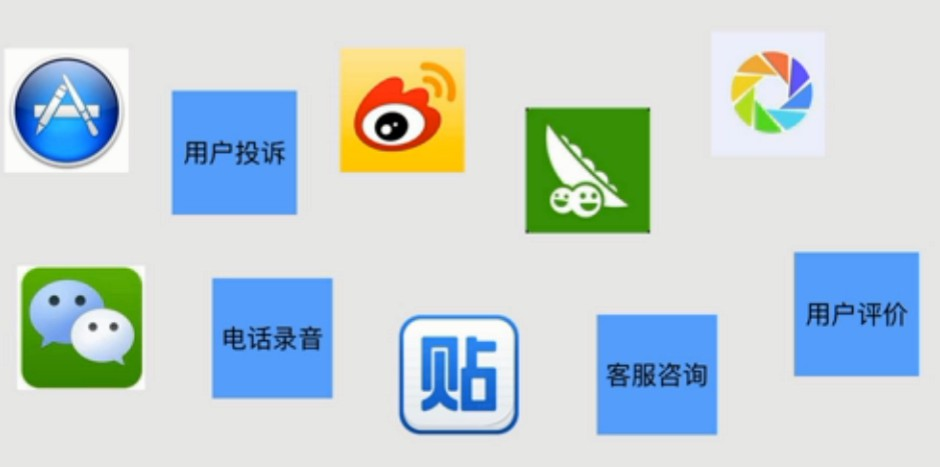
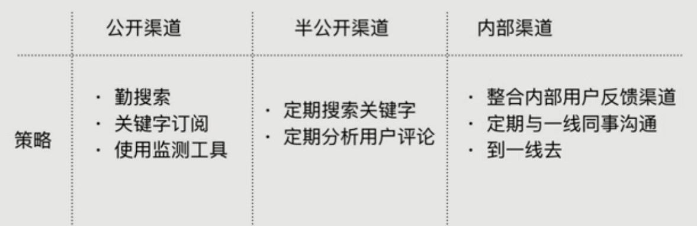
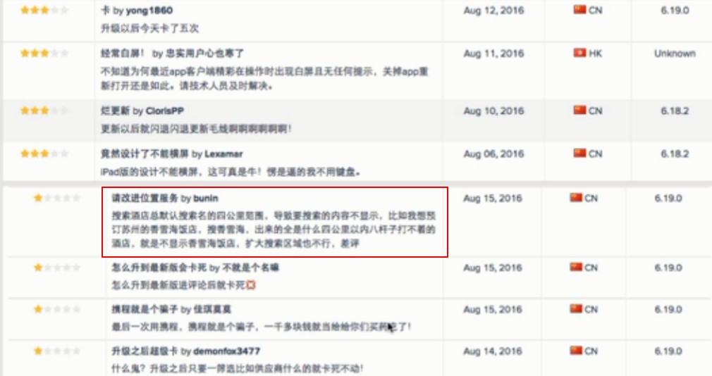

# 通过用户反馈发现问题

> 认识产品的方法有很多，各种调研产品的方法也很多，凭我多年的经验，最有效的方法是通过**用户反馈**，通过用户反馈来去了解产品的现状和问题，是最高效最有用的方法。

快速的了解自己的产品和竞争对手的产品，从中发现一些问题，有什么具体的方法呢？通过各种渠道了解到**用户的反馈**，从中了解到他们在产品使用过程中有哪些个比较痛苦的点。还有一些其他的方式，**去客服中心体验一下**，**去前台做一天的工作人员**，这样直接的与用户接触的方式。

通过用户反馈，可以了解：

1. 自身产品的问题。不同用户在使用的过程中可能有不一样的情况。
2. 竞品的问题。可能是内部也可能是外部的竞品，有可能有些东西他们已经做了，有些反馈可能是比较稳妥和直接。少走弯路。
3. 可能的机会点。用户有可能有新的需求。

通过哪些渠道来收集用户的反馈呢？

▲ 可以通过这些平台想办法获取用户反馈(半公开渠道，我们可以潜入竞品的用户群里面去，或者付费成为他们的用户。)

具体策略：

## 一、APP store

* iOS:AppStore
* 安卓：360手机助手、安卓市场、百度手机助手、小米应用商店、
* 安智市场、豌豆英等
* 常用工具：AppAnnie、应用雷达、ASO114等

主要是监控**低分差评**：1-3分。  
**有效评论**：重点看有实际描述的评论。  
**异常行为**：比如水军刷榜、恶意评价，要注意分别。  
**竞品变化**：监控竞争对手的应用变化，这样可以借鉴。

▲ 标示框内是高质量的评论反馈

▲ 涉嫌刷好评，短时间内大量好评，有嫌疑。

## 二、主流的社交平台与常用工具

主流平台包括：微博，贴吧，知乎，人人网，雪球等。不同的用户群体可能是不一样的，例如，学生 -> 人人网； 股票 -> 雪球。

具体的工具方法：关键字 + 收藏夹、微博企业版(有一个监控的功能)，百度，google等。

## 三、通过用户的点评

重点看：

* **差评**：为什么差评？原因，现象是什么？
* **描述**：重点看有实际描述的评论。
* **异常行为**：比如是否刷好评的行为？有没有恶意评价行为？