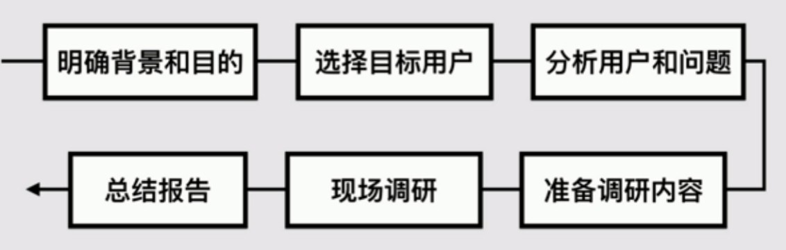
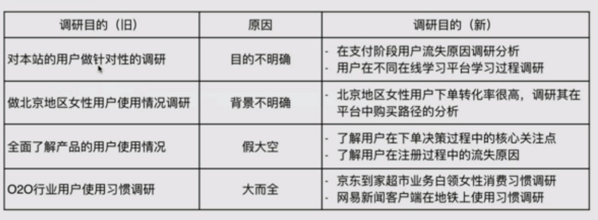
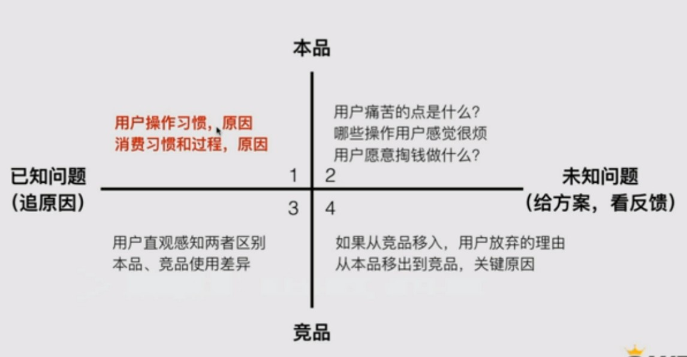

## 用户调研的全过程

## 明确的背景和目的

**背景**：什么情况下发起的调研？是否必须用调研来解决？  
**目的**：通过用户调研希望得到的结果是什么？

▲ 尽量的细化和明确 

## 选择目标用户

* **典型用户**：通过简单的用户画像，找出典型用户
* **目标用户**：时间、地点、配合程度
* **邀约用户**：直接说明目的，并告知可能发生的情况
* **用户数量**：不宜扫网式，一般5-10个

## 猜测用户问题设定题目

先想一下用户可能遇见的问题，针对性的准备问题。

* **用户可能的问题**：用户的使用行为表现
* **可能的解决方案**：猜测解决用户问题的手段
* **确定访问提纲**：聚焦且开放的问题
* **题目数量**：线上10-20道，线下5-10道

▲ 1.2在初级阶段要掌握的

## 调研、访谈

* **了解用户使用过程**：最好观察用户的行为
* **提问**：对关键行为、预设问题进行提问
* **反馈**：对有效的信息反馈给用户，并深究

## 用户调研总结

* **单个用户**：记录单用户的调研情况
* **整体情况**：汇总用户调研的过程和结论
* **行动计划**：分享并提出行动计划

## 如实还原积极反馈

* **还原**：用户是怎么使用出问题的？
* **反馈**：提出改进计划，并及时通报